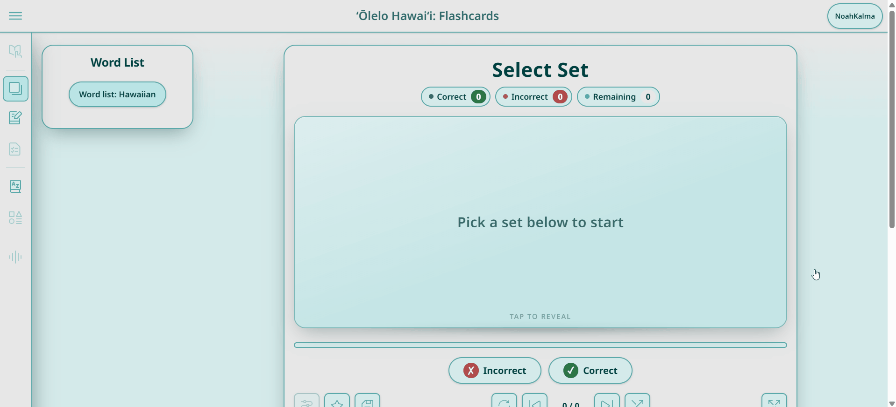
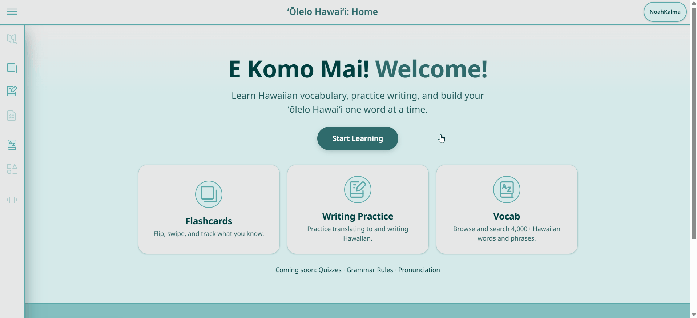
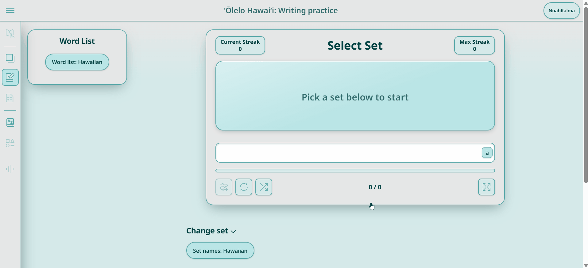
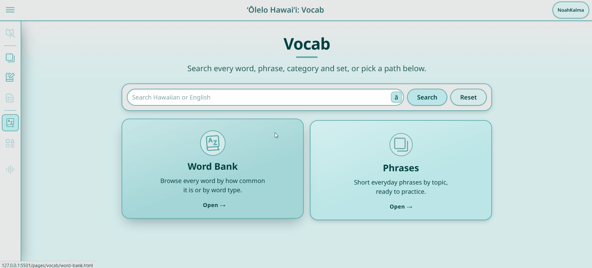

# ʻŌlelo Hawaiʻi: Hawaiian Language Learning App


A web app for learning Hawaiian, with vocabulary organized by word type and category. Includes a searchable word bank, flashcards, and writing practice, backed by a Python/FastAPI API with user accounts, favorites, and saved study progress.

Vocabulary and language content is developed with Kennedi-Grace Magaoay, a linguistic anthropologist specializing in Austronesian languages.

**Live demo:** [learnhawaiian.netlify.app](https://learnhawaiian.netlify.app/)

Warning: I am planning to begin running a server on a raspberry pi but, until then, the server only runs locally so this is a static site demo

---

## Demos

### Flashcard Demo


### Home and Profile Pages Demo


### Writing Practice Demo


### Word Bank Demo


---

## Features

### Learning
- **Vocab Hub**: central hub linking to Word Bank and Phrases pages with global search
- **Word Bank**: browse Hawaiian vocabulary organized by frequency level or part of speech
    - **By Frequency**: filter words by frequency level (5 = most common, 1 = rare) with interactive chips; default shows Level 5
    - **By Type**: grid of parts of speech (nouns, verbs, adjectives, etc.) → sets organized by category
    - **Categories and Subcategories**: browse within each part of speech and category
    - **Word Search**: search through words, categories, and set names in Hawaiian or English
    - **Hawaiian/English Toggle**: flip the language side of the display
- **Phrases Page**: dedicated section for Hawaiian phrases, grouped by category
- **Hawaiian Letter Keyboard Popup**: click the "ā" icon in the writing-practice answer box or the vocab searches to insert Hawaiian letters:
    - Letters: ʻ (ʻokina), ā, ē, ī, ō, ū (macron vowels)
    - ⇧ key toggles uppercase (Ā, Ē, Ī, Ō, Ū)
- **Flashcards**: study any word type, category, set, or frequency level
    - **3D Card Flip**: click the card or press Space/Enter to flip with a smooth 3D animation
    - **Swipe Grading**: drag right to mark correct (✓), left to mark incorrect (✗); release at 30% card width or with velocity
    - **Keyboard Grading**: press `C` or `2` for correct, `X` or `1` for incorrect; arrow keys navigate
    - **Live Tally**: real-time counter of correct, incorrect, and remaining cards
    - **Review Missed**: after grading all cards, review and re-grade incorrect answers
    - Shuffle and restart deck with all features working
- **Writing Practice**: study any word type, category, set, or frequency level; shuffle, reset, and practice translation word-by-word with a streak counter. Answers are compared in a normalized form (composed kahakō, trimmed spaces, apostrophe look-alikes treated as the ʻokina), and a near miss gets the hint "Almost! Check your kahakō and ʻokina."
- **Quizzes**: pick a set (3+ unique words) and take a 10-question quiz (5 for sets under 10 words) mixing typing, multiple choice and drag-a-line matching. No feedback until you submit; then a score with a full review (your answer vs the correct one) and an "only mistakes" filter. Works logged out; logged-in users also earn streak credit and quiz achievements
- **Streaks & Achievements**:
    - **Daily Streak**: track consecutive days of study (local calendar days); strictly resets to 1 the day after a gap; out-of-order or same-day events do not reset
    - **What Counts**: graded flashcards, correct writing answers, and finishing a whole set; each frequency filter level (5, 4+, 3+, 2+, All) counts once per set, while "Review incorrect" decks and repeats don't count
    - **Per-Set Best Writing Streak**: each set remembers your best "correct in a row" streak for writing practice
    - **60 Tiered Achievements**: 10 levels in each of 5 categories, plus Quizzes Completed (1 → 100) and Perfect Quizzes (1 → 20) — Cards Studied (10 → 2,000), Words Written (10 → 2,000), Sets Completed (1 → 100), Daily Streak (3 → 100 days), and Best Set Streak (5 → 40 in a row, then "Perfect Set")
    - **Unlock Toasts**: a discreet notification appears when you earn an achievement
    - **Profile Display**: the profile shows your current streak and one scrolling row of round badges: first the level you've reached in each category, then the next level to earn in each, with its progress (e.g. "30 / 50"). Faded edges and arrow buttons show when there are more badges to scroll to
    - **Logged-In Only**: streaks and achievements are saved per account; logged-out study isn't tracked (a "Log in to save your streak" note is shown) and writing practice's Max Streak lasts only for the session

---

## Word Data

Vocabulary is stored in a plain-text source file (`pages/word-bank/words/to-json.txt`) that is parsed into JSON by a Python script. This allows hand-editing of words, frequency levels, and categories without database setup.

### File Format

Each line has one of these formats:
- **Comment**: `// anything` — ignored by the generator
- **Part of Speech**: `!Hawaiian Name (pos_key)` — one of: `verbs`, `nouns`, `adjectives`, `adverbs`, `short_phrases`, `pronouns`, `prepositions`, `conjunctions`, `articles`
- **Category Open**: `@Category English (Category English)` — starts a category; must later be closed with the exact same line repeated
- **Set**: `#Set English (Set English)` — starts a word set (inside or outside a category)
- **Word**: `hawaiian | english | pronunciation | frequency` where:
  - `hawaiian`: the Hawaiian word (ʻokina variants and quotes are normalized)
  - `english`: English definition
  - `pronunciation`: pronunciation guide
  - `frequency`: optional, 1–5 (1 = rare, 5 = most common); defaults to 3 if omitted; invalid values are errors

### Workflow

1. **Edit** `to-json.txt` to add or update words; you can paste new content in the existing format (3-field or 4-field word lines, new POS headers, categories, and sets)
2. **Generate**: run `python pages/word-bank/words/json-generator-full.py` from the repo root
   - Creates/updates `data/**/*.json` files and `index.json`
   - Removes stale JSON files no longer referenced
   - Normalizes ʻokina variants, quotes, and all Hawaiian strings to NFC form
   - Reports words with missing frequency (defaulted to 3) in a single summary warning
   - Hard errors on: unknown POS header, misconfigured category nesting, category or POS header while another category is open
3. **Validate**: run `python pages/word-bank/words/validate-data.py` from the repo root
   - Ensures all index paths exist, all data files are indexed, and all words have the 6 required fields
   - Validates frequency ∈ 1–5, unique set IDs, NFC normalization, and frequency spread (8–35% per level, each POS/category with ≥10 words has ≥3 levels)
   - Exits with status 1 on failure

### Generated JSON

Each word appears in its set's JSON file with these fields:
- `hawaiian`: the Hawaiian word
- `english`: English definition
- `pronunciation`: pronunciation guide
- `frequency`: 1–5 (frequency level)
- `part_of_speech`: the POS key (e.g., `nouns`)
- `lesson`: lesson ID (currently empty string `""`)

Each set also includes metadata:
- `category_english`, `category_hawaiian`: the enclosing category name(s)
- `in_category_english`, `in_category_hawaiian`: the set name
- `part_of_speech`: the POS key

### URL Parameters

- **`?set=<set_id>`**: load a specific set by its ID (e.g., `Animals/Birds-nouns` or `freq-5` for a frequency set); IDs are URL-encoded
- **`?minFreq=<1-5>`**: minimum frequency filter for the set (only applies to normal sets, not frequency sets)
- **`?currIndex=<n>`**: start on card/word at index `n` (used by resume/continue links)
- **`?levels=5,4,3`**: (By Frequency mode) comma-separated levels to display
- **`?word=<search term>`**: search results for the term
- **Legacy `?setName=`**: (backward compatible) resolves to the first matching set name; new links use `?set=` instead

---

## Progress Tracking
- **Save Progress**: save your place in any flashcard set and pick up on the same card later. Saving on the last card marks the set complete and removes it from your in-progress list
- **Favorites**: favorite any set from the flashcard page, stored per user on the backend

### Profile
- **Continue Learning**: every saved in-progress set, sorted by most recently studied, with a progress bar and a resume button that opens the set on the saved card (includes saved frequency filter if one was active)
- **Favorited Sets Display**: all favorited sets (normal sets and frequency sets) with their word counts, each linking straight to that set's flashcards or writing practice
- **Account Settings**: change username, email, or password (the current password is required to set a new one), or delete your account along with all of its saved data
### Accounts
- Register and log in with a username or email
- JWT-based authentication with bcrypt-hashed passwords

---

## How This Was Built

### What I built
The original version of the site was my own work, with vocabulary and language content from Kennedi-Grace Magaoay:
- **Vocabulary pipeline**: the plain-text source format (`to-json.txt`) built from our custom dictionary drafts, and the Python generator that turns it into one JSON file per set
- **Word bank**: browsing by part of speech → category → set, with a search that ignores kahakō and ʻokina so learners can type without them
- **Flashcards**: set selection by type, category, or set, a flip, shuffle, restart, a progress bar, and keyboard shortcuts
- **Writing practice**: word-by-word translation with a current and max streak counter
- **Backend (FastAPI + SQLAlchemy + SQLite)**: registration and login with JWT and bcrypt, editing and deleting accounts, favorites, and continue-studying progress on the profile
- **The site's look**: layout, teal color palette, icons, header and side navigation

### Improving it with Claude Code
After meeting with a linguistics professor, I had a list of changes: better UI, a Hawaiian letter keyboard, category search, frequency levels for every word, a Vocab section with a Phrases page, frequency-based set selection, and swipe-to-grade flashcards. Later I added streaks and achievements. I used [Claude Code](https://claude.com/claude-code) to plan and build these, with me making the decisions along the way:

1. **Requirements interview.** Claude interviewed me one question at a time (logged-out behavior, how frequencies should work, what counts as "completing" a set, how streak days are defined) until the request was a written spec with testable acceptance criteria.
2. **Reviewed plan.** A planner wrote an implementation plan, then separate architect and critic reviews checked it against the real code before anything was written. This caught real problems early, for example:
   - 147 of the 422 sets shared a name with another set, so links could open the wrong set; sets now have stable path-based IDs
   - study events arriving at the same time could lose counter updates, and a late event could reset a streak
3. **Parallel implementation.** The work was split into pieces with separate files (data pipeline, backend, keyboard, Vocab pages, set selection, flashcards, UI) and built by multiple agents at once, with a snapshot of every file taken before changes.
4. **Verification.** Changes were checked in a headless browser (clicking through flashcards, writing practice and search with temporary accounts), with axe-core accessibility scans, touch-target and phone-width checks, and backend `pytest` tests (including a 20-request concurrency test).
5. **UI/UX reviews.** Reviews against accessibility and design guidelines found contrast failures, icon buttons without labels, unlabeled form fields, controls under 44px, and a busy home page. These were fixed in four rounds, each of which could be undone.
6. **Iterating with me.** For design choices, Claude built options for me to pick from. For example, a preview page showed the achievements in five layouts, and I chose my original round-badge style and then refined it (earned badges first, scrolling row with fade hints).

Bugs found and fixed along the way:
- 4 sets that were silently hidden behind duplicate names now show up
- data files whose capitalization didn't match the index (they would have returned 404s on Netlify) were fixed, and 237 unused JSON files were removed
- writing practice ignored `?set=` links and opened an empty deck
- an expired login was never cleared, which caused a login/profile redirect loop
- correct answers with a decomposed "ā" or a trailing space were marked wrong

I kept control of the decisions (what counts toward progress, badge levels, layouts, and wording), and Kennedi-Grace and I are still responsible for the Hawaiian content itself.

---

## Tech Stack

- **Frontend:** HTML, CSS, JavaScript (vanilla, no frameworks)
- **Backend:** Python, FastAPI, SQLAlchemy, Pydantic
- **Database:** SQLite
- **Auth:** JWT tokens (python-jose), bcrypt password hashing

---

## API Overview

All routes except `/register` and `/login` require a bearer token.

| Method | Route | Purpose |
|---|---|---|
| POST | `/register` | Create an account |
| POST | `/login` | Log in with username or email, returns a JWT |
| GET | `/signed-in-user` | Current user's username and email |
| POST | `/edit-user` | Change username and email |
| POST | `/edit-password` | Change password (verifies the current one) |
| POST | `/delete-account` | Delete the account and all of its data (verifies the password) |
| GET | `/favorites` | List favorited sets (includes `set_key` for each) |
| POST | `/favorites` | Favorite or unfavorite a set (uses `set_key` for stable identity) |
| GET | `/continue-sets` | In-progress sets, most recent first (includes `set_key` and `min_frequency`) |
| POST | `/continue-sets` | Save progress in a set or frequency filter, or mark it complete (uses `set_key` and `min_frequency`) |
| POST | `/activity` | Record a study event (card graded, word correct, or set completed); returns newly unlocked achievements |
| GET | `/progress?today=<YYYY-MM-DD>` | User's stats (cards studied, words written, sets completed), display streak, and all 60 achievements with progress |
| POST | `/quiz-results` | Record one submitted quiz summary (idempotent on `quiz_id`; works logged out); logged-in callers get streak credit and newly unlocked achievements |
| GET | `/set-progress?set_key=<key>` | Per-set best writing streak |

With the backend running, interactive docs are available at `http://127.0.0.1:8000/docs`.

**Important:** The `/activity` endpoint serializes write requests using a process-level lock to ensure exact counts and atomic achievement unlocks. This design is valid only for a single uvicorn worker. If deploying to multiple workers in the future, use an idempotent event log with a unique constraint instead.

---

## Running it locally

```bash
git clone https://github.com/NoahBKalma/hawaiian-language-website.git
cd hawaiian-language-website
```

**Backend:**
```bash
cd backend
pip install -r requirements.txt
```
Create a `.env` file in `backend/` with:
```
SECRET_KEY=your-random-secret-here
```
If you have an old `hawaiian.db` from before the set-ID migration, delete it (the schema has changed):
```bash
rm hawaiian.db
```
Then run:
```bash
uvicorn main:app --reload
```
This starts the API at `http://127.0.0.1:8000` and creates a fresh `hawaiian.db` on first run.

**Backend tests:**
```bash
cd backend && .venv/Scripts/python.exe -m pytest tests -q
```
Tests verify streak rules, concurrent activity handling, achievement unlocks, and API responses. The test suite uses a temporary SQLite database and does not modify the main `hawaiian.db`.

**Frontend:**
Serve the project root with any static file server (e.g. VS Code's Live Server extension) and open `index.html`. The frontend talks to the backend at `http://127.0.0.1:8000` by default (see `scripts/config.js`).

If you use Live Server, add `"**/*.db"` and `"**/*.db-journal"` to `liveServer.settings.ignoreFiles` in your VS Code settings. Otherwise the page reloads every time the database is written to.

---

## Project Structure

```
backend/       FastAPI app: auth, database models, schemas, API routes
scripts/       Frontend JS, one file per page/feature
components/    Reusable custom elements (header, nav, set selection, word bank display)
pages/         HTML pages
styles/        CSS
assets/        Icons, images, and dictionary PDFs
```

---

## Status

In development. Recently added:
- Vocabulary data pipeline with frequency levels and parts of speech
- Vocab hub with Word Bank (by frequency and type) and Phrases pages
- Hawaiian letter keyboard popup on the writing practice and vocab search inputs
- Flashcards with 3D flip, swipe grading, and live tally
- Frequency filter and frequency sets in set selection (flashcards and writing practice)
- Favorites and saved study progress keyed by set id
- UI refresh with design tokens and animations
- Daily streaks, activity tracking, and 50 tiered achievements (10 per category) with unlock toasts and profile display

Still placeholder: word frequencies are demo values (to be hand-edited in `to-json.txt`), Hawaiian names for frequency levels and most categories are English placeholders, and the `lesson` field is empty.

Planned features: spaced repetition using per-word results, per-word lessons, and more phrases and Hawaiian language content.

A static frontend demo is live at the link above. The backend (accounts, favorites, progress) currently runs locally only; deployment to a self-hosted Raspberry Pi is planned.